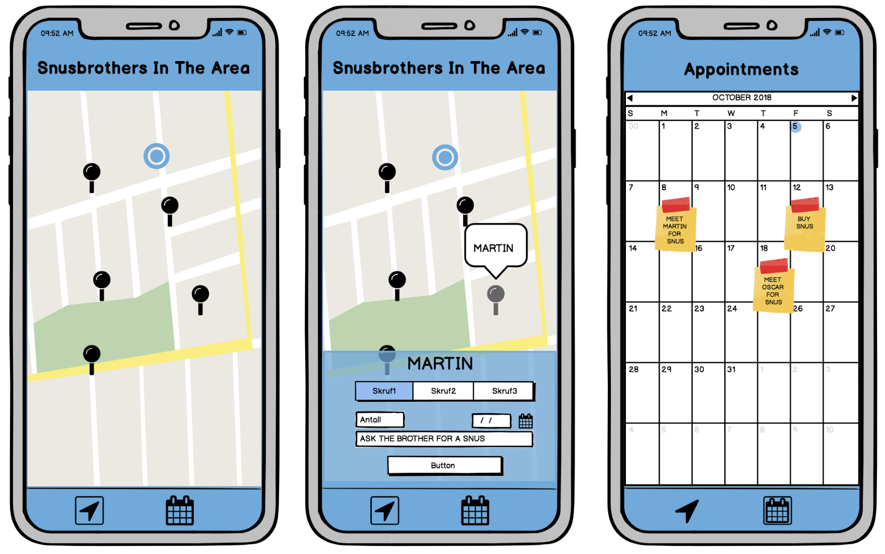
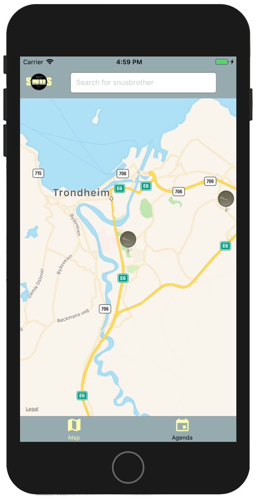
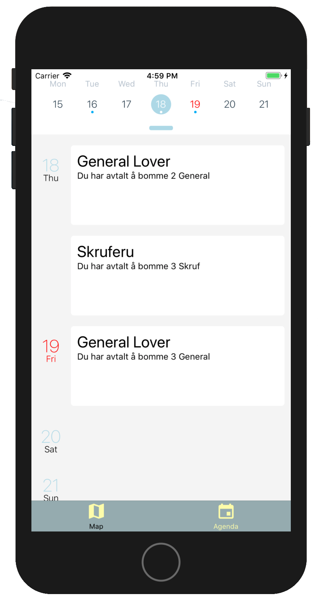

## Intro
Snus.
We have all tried it, and we all love it. It’s the life and core of how every Scandinavian youth get through their day. 
But snus comes with one terrible catch. NOT HAVING MORE SNUS.

SNUSBROTHERS is a mobile app designed to solve this problem. With one touch, the consumer can find nearby snus-users, and setting up appointments to bom(receive) snus. One can easily search for known users, or just pick the user closest to your own location. Once the snusbrother you want to bom from is decided, you will get the option to choose from the different kinds of snus, choose the amount, and set up a date and time to meet.   

The application implements external modules such as 'react-navigation' , 'react-native-maps' and 'react-native-calendars'. The use of theese modules will be described later on in this document. Aswell as how we use AsyncStorage to save state after you exit and enter the application

## Planning
After discussing the assignment and brainstorming for ideas, we decided to create a low-level prototype of how we wanted the apperance and functionality to be. This was done using Balsamiq, and allowed us to design the app using pre-built widgets and a drag-and-drop WYSIWYG editor. Here is the final prototype: 

  


## Expo
Expo is a set of tools, libraries and services which let you build native iOS and Android 
apps by writing JavaScript.
It is the easiest way to get started building React Native applications. It
allows you to get started without installing or configuring Xcode or Android Studio 
for building native code. As long as you have Node.js on your computer you can use npm
(node package manager) to install the Expo CLI command line utility.

```
npm install -g expo-cli
```

Now that you have have the command line utility you only need to run one line to get
started with your React Native project.

```
expo init AppName

cd AppName
npm start
```
This will start the application and was exactly how we got started with the SnusBrothers
project. 

So Expo apps are just React Native apps which contain the Expo SDK (Software Development
Kit). The SDK is a native-and-JS library which provides access to the device's system functionality 
(things like the camera, contacts, local storage, and other hardware). If you want
a deeper understanding of what Expo is i recommend visiting their own documentation site at
https://docs.expo.io/versions/latest/


## Third Party Modules

### Navigation
React Navigation is born from the React Native community's need for an extensible yet 
easy-to-use navigation solution written entirely in JavaScript (so you can read and 
understand all of the source), on top of powerful native primitives.   

Mobile apps are rarely made up of a single screen. SnusBrothers is no
exception. To manage the presentation of, and transition between,
multiple screens we have used React Navigation which is a standard
when getting started using React Native. React Navigation provides
an easy to use navigation solution, with the ability to present a common
tabbed navigation pattern that most users are familiar with on iOS
and Android.   
In App.js you will see how the stack of screens looks like:

```javascript
import { createBottomTabNavigator  } from 'react-navigation';
export default createBottomTabNavigator ({
    // Here we add the different screens
    Map: {
        screen: MapScreen
    },
    Calendar: {
        screen: AgendaScreen
    }
},
...
);
```
As you can see we are creating a TabNavigator. We do this so we get the menu at the bottom of 
the screen so we easily can switch between Map- and AgendaScreen. 

This works right out of the box on you do not need any special configuration to make this
work good. You can fill in some more options when creating the navigator as we do over. 
This is configuration about what icons to use and what colors for example. You can read more 
about this in their documentation at:
https://www.reactnavigation.org/docs/en/getting-started.html 


### Map

 

For the MapScreen we choose to use React Native Map, a module created and maintained by Airbnb. The module is easy to use, and includes usefull components like; MapView, Markers, Callout, Polygon, PolyLine, Circle and Overlay.

Let us take a look at how easy it is to implement the module in your application. 
The following code is an example of how you can render a map and place a marker on it.

<br/><br/>
```javascript
 <MapView  style={styles.map}
           initialRegion={{
               latitude: 63.41927,
               longitude: 10.40206,
               latitudeDelta: 0.0922,
               longitudeDelta: 0.0421,
             }}>
     <Marker coordinate={{
               latitude: 63.41927,
               longitude: 10.40206
             }}
             title={"Me"}
     />
</MapView>
```
As you can see the MapView takes a initalRegion param which tells the map which region and how much zoom it should have when you start. We can also se how the marker takes its own coordinate which we here have hard coded to be at an exact position. 


### Calendar


For the AgendaScreen we choose to use React Native Calendars 
which is an easy to use module that includes various customizable react 
native calendar components. SnusBrothers are suppose to see 
their appointments here so they have no trouble in scheduling
their snus-use. 
<br/><br/>
<br/><br/>

The Agenda component had everything we wanted. It had an calendar and a screen where 
we can view the appointments. We are able to customize it a lot. We can make customized
items in the agenda and change the theme as we want easily.


<br/><br/>
Let us take a look at how we implemented the AgendaScreen.

```javascript
<Agenda
        // A week start from Monday(1)
        firstDay={1}
        // See example of item structure over
        items={this.state.addedItems}
        // Callback that gets called when items for a certain month should be loaded (month became visible)
        loadItemsForMonth={this.loadItems.bind(this)}
        // Selected date on startup - Should me today
        selected={new Date()}
        // Specify how each item should be rendered in agenda
        renderItem={this.renderItem.bind(this)}
        // Specify how empty date content with no items should be rendered
        renderEmptyDate={this.renderEmptyDate.bind(this)}
        // Specify your item comparison function for increased performance
        rowHasChanged={this.rowHasChanged.bind(this)}
        // Specify theme properties to override specific styles for calendar parts. Default = {}
        theme={{
            selectedDayBackgroundColor: "lightblue",
            agendaDayTextColor: 'black',
            agendaDayNumColor: 'lightblue',
            agendaTodayColor: 'red',
            agendaKnobColor: 'lightblue',
            todayTextColor: 'red',
        }}
    />
```
We are just taking use of some of the customizable settings for the Agenda. In their
documentation on https://github.com/wix/react-native-calendars  you can read much more about
what you can customize here. The most important to look at here are how we give the 
component our items, how we load items for each month at the time depending on where 
the user are looking and how these items should be rendered. 

All the items we show in are Agenda are being saved with AsyncStorage which we are going 
write more about afterwards. 


## AsyncStorage
AsyncStorage is a library for React Native that is used to store data locally within the app. This is
useful when you have data that is only relevant for the specific user, for example if you don't always want
to log in when you open the application. For our application we use AsyncStorage for saving the new appointments
that the user adds. We have also stored fictional users that have snus available. This is simply for being able
to use the application. We also have som preloaded appointments that the user can see, so that you get an
understanding of how the application works. When using AsyncStorage you have to stringify the JavaScript object,
as AsyncStorage only understands strings. For our app it would only be necessary to save our appointments in
AsyncStorage, as users would always change position, so they would have to be updatet externally.


## Testing
### Jest
What is Jest and why are we using it? First of all Jest is a complete and ready to set-up 
JavaScript testing solution that works out of the box for any React project. When we
did the expo init command that we talked about in the beginning, Jest was already then 
implemented in the project. This makes Jest a very natural choice.   
Jest does also have fast interactive watch mode only runs test files related to changed files and 
is optimized to give signal quickly. Jest can also capture 
snapshots of React trees or other serializable values to simplify testing and to 
analyze how state changes over time. These kind of snapshots can you find several times
in our test cases.   

```javascript
const tree = renderer.create(<Component/>).toJSON();
expect(tree).toMatchSnapshot()
```
Here you can see an example of how you can compare your component to a snapshot. Your
snapshot should be a representation of how you would like the component to look like. 

We have made test files for all our React components and they all are located in test folders
and ends with "-test.js". This is so that Jest knows which test files to run on the npm test
command. 

We have also did systematic tests so that we know that the application works both for 
iOS and android. An example of a problem that occurred under development was with the 
DatePicker. This is different for the two platforms. We are therefore rendering different code 
based on which platform the user are on. 
