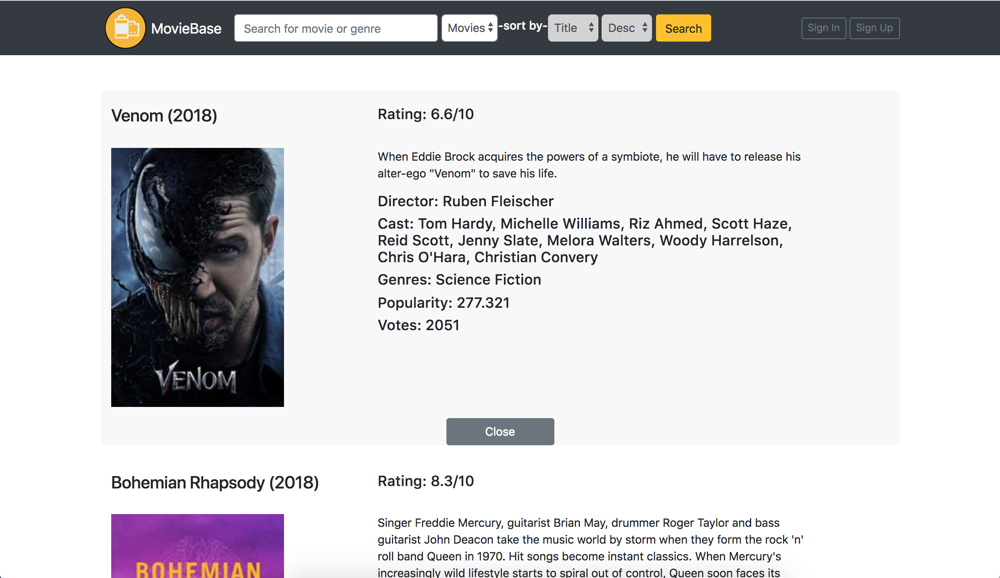
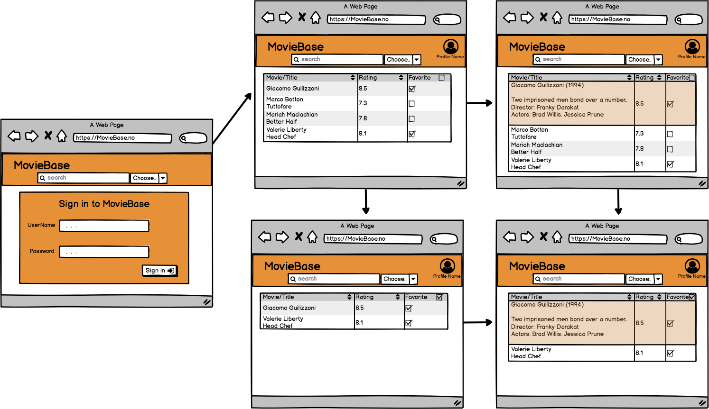
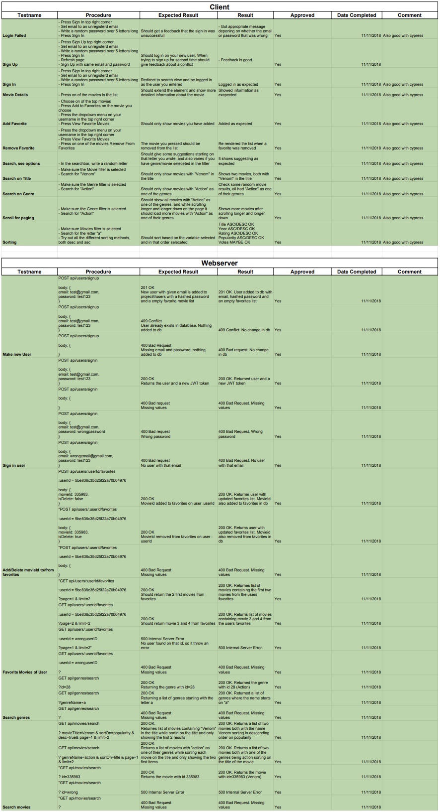

# Project 4 - MovieBase
  

## Intro
’Movie DataBase’ is, as the name implies, a movie database on the Web.
We offer a searchable catalogue of more than 19.000 movies. Search for your favorite movie by title, or for movies in a specific genre.
The result can be sorted by title, year, rating, popularity or votes, you decide. We also offer the ability to sign up and create a perfect list of all your favorite movies.

## Planning
After discussing the assignment and brainstorming for ideas, we decided to create a low-level prototype of how we wanted the apperance and functionality to be.
This was done using Balsamiq, and allowed us to design website using pre-built widgets and a drag-and-drop WYSIWYG editor. Here is the final prototype:

  

# Content and Functionality

## Client
For our front end application we have used React together with Redux to manage application state. For navigation
we have used react router as this is an easy way to deal with navigation in a React app, and makes it easier to
generate understandable URLs. The design for of the page is mostly created with bootstrap and the Reactstrap library.
We did not want to spend too much time on the page design, and these types of libraries make it way more efficient
to create good looking components.

### Application Structure
The structure of the components is divided into three parts:

* The layout components
* User components
* Movie info components

The layout components are the ones that actually show the information we want to show the user. The Navbar component is where
a user can search for movies, sign in og create an account, as well as display the user's favorite movies. This is done by
using React-router-dom's Link component to go to the different URLs. For search we use local state that handles all the
search paramenters, and to show the user's favorite movies, we link to ="/favorites".
```javascript
<Link to={`/search/${searchURL}`}><Button style={{"marginLeft": "5px"}}>Search</Button></Link>
```

In these components we also wanted to be able render more movies when a user scrolled to the bottom of the page.
To handled this we used react-bottom-scroll-listener. This is a simple react library that listens to the dom, and knows if a
user has scrolled to the bottom of the page. When this happens an onBottom function is called, and we call a defined function.
 ```javascript
<BottomScrollListener onBottom={this.loadNewMoviesFromSearch}>

loadNewMoviesFromSearch = () => {
    if (this.props.loading || this.state.bottom) {
        return
    }
    const {query} = this.props.match.params;
    const url = `movies/search?${query}&page=${this.state.pageNumber}&limit=10`;
    this.props.search(url, this.state.pageNumber).then((newMovies) => {
        this.setState({
            bottom: newMovies === 0,
            pageNumber: this.state.pageNumber + 1
        });
    });
};
 ```

The user components are just the two components that you either sign in with, or create a user with. They are only visible
in the navbar whenever a user is not signed in.

The movie info components are the entire movie list that is available in the state, and also each movie's detail, containing
the more detailed info about the movie. We added a movie loader component that is simply the loading icon that appears on the
bottom of the list whenever the user performs a new search.

### Redux
Redux is a state container that manages all the global application state in a store that is accessible to all
components when needed. In our project we separate the redux store into separate reducers to manage
the different types of state that are relevant. Each reducer is a function that receives an action, and each action has
a type. The reducer then uses a switch to determine what action is dispatched and knows what to do with state.
In our project we have used action creators that dispatch different actions based on the time, and the payload of
the asyncronous call to the database. For example, our Search action first dispatches an INITIATE_SEARCH action, so
that the components knows it is loading.

```javascript
const OptionReducer = (state = [], action) => {
    switch (action.type) {
        case "FETCH_OPTIONS":
            return {
                options: [...action.payload]
            };
        default:
            return state;
    }
};
```

```javascript
export const OptionSearch = (index, searchName) => dispatch => {
    let queryTerm = index === 'movies' ? "movieTitle" : "genreName";
    const url = `/api/${index}/search?${queryTerm}=${searchName}&sortOn=popularity&desc=true&page=1&limit=6`;
    return axios.get(url)
        .then((res) => {
            dispatch({
                type: "FETCH_OPTIONS",
                payload: res.data[index]
            });
        })
};
```


To be able to do this we had to use the [combineReducers](https://redux.js.org/api/combinereducers) helper function from
Redux that helps us combine the different reducers in a rootReducer file. This made the state management more structured, and easier to understand.
It is done like this:
 ```javascript
 const rootReducer = combineReducers({
    auth: AuthReducer,
    movie: MovieReducer,
    options: OptionReducer,
});
 ```

To get access to the application state, you have to `mapStateToProps` as well as `connect` from `'react-redux'`.
This will give component access to the desired application state. In the export statement you have to use connect to access
the store

```javascript
const mapStateToProps = (state) => {
    return {
        user: state.auth.user,
        movies: state.movie.movies,
        loading: state.movie.loading,
    }
};

export default connect(mapStateToProps)(Component);
```

### Redux Thunk

Since we are using asyncronous code in our project, and we only want to update application state when an action dispatches
we have to use some middleware that makes sure that the reducers' are handled appropriately. To do this, we have used Redux Thunk,
a redux middleware for this. We add it to the store in the index.js file, inside the store object.

```javascript
const store = createStore(rootReducer, applyMiddleware(thunk));
```

### React Router Dom
We have used react router dom to make easier to navigate between components within the app. This is done by creating
routes in the URL that specify what component is displayed on the screen. You do this by creating a switch to match the
URLs to the appropriate component. You can also add conditional Routes such as the route that shows the SearchList component.
We have done this because we want the component to use the query parameter to do a search, and whenever this changes
the component updates and does a new search based on the URL.

```javascript
<BrowserRouter>
    <div>
        <AppNavbar/>
        <Switch>
            <Route path={'/signUp'} component={SignUp}/>
            <Route path={'/signin'} component={SignIn}/>
            <Route path={'/search/:query'} component={SearchList}/>
            <Route path={'/favorites'} component={FavoritesList}/>
            <Route exact path={"/"} component={HomePageList}/>
        </Switch>
    </div>
</BrowserRouter>
```


## Backend
### Database
First of all we had to get our data from somewhere, we did not want to generate
them our self, so we used TMDB (https://developers.themoviedb.org/3) which had a
well explained API documentation that was easy to use. We made a python script
to do requests on this API and used the data we collected from TMDB to build
our new database.

Our database is a MongoDB. The reason we choose to use mongodb
was because it was NoSQL and it was easy to get stared with. We also heard about
Mongoose that had some nice and easy features for us to do sorting, filtering
and paging which made the choice easier.

Before we could insert the data that we collected from TMDB we had to make the database on the NTNU server. We followed the user manual from mongoDBs documentation (https://docs.mongodb.com/manual/tutorial/install-mongodb-on-ubuntu/). After we had installed mongo we started it, and the only thing missing before we could make the database was some small configurations and to make the users.

To make the users we used this command:

```javascript
db.createUser({
    user: 'myusername',
    pwd: 'mypassword',
    roles: [{ role: 'readWrite', db:’databasename’}]

})
```

And the small configurations we had to do in the `mongod.conf` file was change the bind port and the security settings


```
…
net:
	port: 27017
	bindIp: 0.0.0.0

…

security:
	authorization: “enabled”
…
```

### Webserver with Node.js/Express
Express is a web framework for Node.js. It is with express that we arranges all
our routes/endpoints. To tell the express app where it should get all the
different information about the routes we write:

```javascript
const users = require("./routes/api/users");
const movies = require("./routes/api/movies");
const genres = require("./routes/api/genres");

app.use("/api/users", users);
app.use("/api/movies", movies);
app.use("/api/genres", genres);

```

In our routes you will find all the information about how we get our data from
our mongoDB database and what kind of data we return on the different requests.
As mention earlier we used Mongoose to help us connect to our database.
Mongoose also had a lot of easy to use functions that we have used.
It helped us doing server side sorting and filtering, and it also helped us
do paging so that we could only request parts of the result. It is worth
mentioning that this was something we thought about before we started.
We knew that we were suppose to have a lot of data in our database. That ment
that sorting them and filtering them would take some time. Doing this on the
client side would take to much time, and therefore the best way to do this is
by doing this on the server side.  

Here is an example of how we are doing our request to our database with the help of Mongoose:

```javascript
Movie
    .find({ [searchVariable]: { "$regex": "^"+ searchTerm, "$options": "mi" } })
    .sort({ [sortOn]: desc })
    .skip(skip)
    .limit(limit)
    .then((movies) => {
        return res.status(200).json({
            success: true,
            movies: movies
        })
    })
    .catch(err => {
        return res.status(500).json({
            success: false,
            message: "Internal Server Error"
        })
    });

```

As you can se with `.find()` we can do our filtering, with `.sort()` we
can do sorting and the the combination of `.skip()` and `.limit()`
makes it possible to do paging.

We can also shortly mention that we were planning on using JSON Webtokens
to protect specific routes. But ended up not implementing it. We did genrerate
the webtoken when you signup a new user as you can see in the API documentation,
but we do not do anything with it after it is returned. This could be used
as authentication when requesting our different endpoints, but we did not
feel the need to do more about it in this project as security was not a requirement.


### API Documentation
#### Genres

##### GET /api/genres/search

###### Query String


| Param     | Type   | Info                                           | Required |
|-----------|--------|------------------------------------------------|----------|
| genreName | string | The search term used when searching for genres | required |
| id        | string | Search for genre by ID                         | optional |


###### Responses application/json

| Status          | Schema                                                     |
|-----------------|------------------------------------------------------------|
| 200 (id search) | { success: boolean, genre: {  id: int,  name: string } }   |
| 200             | {success: boolean, genre: [ {id: int, name: string },...]} |
| 400             | { success: boolean, message: string }                      |
| 500    | {success: boolean, message: string}                                                       |


#### Movies

##### GET /api/movies/search

###### Query String

| Param      | Type    | Info                                                                                     | Required |
|------------|---------|------------------------------------------------------------------------------------------|----------|
| movieTitle | string  | The search term used when searching for movies with the title matching movieTitle        | required |
| genreName  | string  | The search term used when searching for movies with on of their genre matching genreName | required |
| sortOn     | string  | The variable to sort the movies on                                                       | required |
| id         | int     | Get movie by the movies id                                                               | optional |
| desc       | boolean | Search in descending order if true                                                       | optional |
| page       | int     | Page number for the result set                                                           | required |
| limit      | int     | Limit for how many movies in the response                                                | required |

###### Responses application/json

| Status          | Schema                                                                                                                                                                                                                                                                                                                                                                                                                                                                                                                                          |
|-----------------|-------------------------------------------------------------------------------------------------------------------------------------------------------------------------------------------------------------------------------------------------------------------------------------------------------------------------------------------------------------------------------------------------------------------------------------------------------------------------------------------------------------------------------------------------|
| 200 (id search) | { success: boolean, movie: { id: int,  genre_ids: [int],  genres: [{id: int, name: string}],  original_title: string,  title: string,  overview: string,  release_date: string,  poster_path: string,  vote_average: double,  vote_count: int,  popularity: double,  credits:[ cast:[{cast_id: int, character: string, credit_id: string, gender: int, id: int, name: string, order: int, profile_path: string }], crew: [{credit_id: string, department: string, gender: int, id: int,  job: string, name: string, profile_path: string}] } }  |
| 200             | {success: boolean, movies: [{id: int, genre_ids: [int],genres: [{id: int, name: string}],original_title: string, title: string, overview: string, release_date: string, poster_path: string, vote_average: double, vote_count: int, popularity: double, credits:[cast:[{cast_id: int, character: string, credit_id: string, gender: int, id: int, name: string, order: int, profile_path: string }],crew: [{credit_id: string, department: string, gender: int, id: int, job: string, name: string, profile_path: string}]}]}           |
| 400             | { success: boolean, message: string }                                                                                                                                                                                                                                                                                                                                                                                                                                                                                                           |
| 500    | {success: boolean, message: string}                                                       |


#### Users

##### POST /api/users/signup

###### Request Body

| Param    | Type   | Required |
|----------|--------|----------|
| email    | string | required |
| password | string | required |

###### Response application/json

| Status | Schema                                                                                    |
|--------|-------------------------------------------------------------------------------------------|
| 201    | {success: boolean, user: {id: string, favorites: [int], email: string, password: string}} |
| 400    | {success: boolean, message: string}                                                       |
| 409    | {success: boolean, message: string}                                                       |
| 500    | {success: boolean, message: string}                                                       |

##### POST /api/users/signin

###### Request Body

| Param    | Type   | Required |
|----------|--------|----------|
| email    | string | required |
| password | string | required |

###### Response application/json

| Status | Schema                                                                                    |
|--------|-------------------------------------------------------------------------------------------|
| 200    | {success: boolean, user: {id: string, favorites: [int], email: string, password: string}, token: string} |
| 400    | {success: boolean, message: string}                                                       |
| 409    | {success: boolean, message: string}                                                       |
| 500    | {success: boolean, message: string}                                                       |


##### GET api/users/:userId/favorites

###### Path Parameters

| Param  | Type   | Required |
|--------|--------|----------|
| userId | string | required |

###### Query String

| Param | Type | Info                                                | Required |
|-------|------|-----------------------------------------------------|----------|
| page  | int  | Page number for the result set                      | required |
| limit | int  | Limit for how many favourite movies in the response | required |

###### Response application/json

| Status | Schema                                                                                    |
|--------|-------------------------------------------------------------------------------------------|
| 200    | {success: boolean,  movies: [{id: int, genre_ids: [int],genres: [{id: int, name: string}],original_title: string, title: string, overview: string, release_date: string, poster_path: string, vote_average: double, vote_count: int, popularity: double, credits:[cast:[{cast_id: int, character: string, credit_id: string, gender: int, id: int, name: string, order: int, profile_path: string }],crew: [{credit_id: string, department: string, gender: int, id: int, job: string, name: string, profile_path: string}]}]|
| 400    | {success: boolean, message: string}                                                       |
| 500    | {success: boolean, message: string}                                                       |


##### POST api/users/:userId/favorites

###### Path Parameters

| Param  | Type   | Required |
|--------|--------|----------|
| userId | string | required |

###### Request Body

| Param    | Type   | Required |
|----------|--------|----------|
| movieId    | int | required |
| isDelete | boolean | required |

###### Response application/json

| Status | Schema                                                                                    |
|--------|-------------------------------------------------------------------------------------------|
| 200    | {success: boolean, user: {id: string, favorites: [int], email: string, password: string}} |
| 400    | {success: boolean, message: string}                                                       |
| 500    | {success: boolean, message: string}                                                       |


# Testing
Before we started making our tests we made a testplan, and ended up doing all
these tests manually aswell. This made the process of writing tests in Jest
and Cypress much easier afterwards. To run these test just do `npm test` and
it should run our server, clinet and end-to-end tests.
You can review the testplan and the results we got from manually doing them here:



## Unit Testing
### Frontend
On the client side we have included tests of asynchronous redux actions. This is done using Jest.
The actions involve API calls using axois, and action creators. In our tests we don't want to perform an actual HTTP request.
In order to avoid making the actual HTTP request we can mock the axios library by using Jest's mocking functionality.
We have created a __mock__ folder inside the client, wich contains the axios/index.js file. We have to mock all axois functions used, and therefor we need both a get and post property inside our mocked Axios.
This is how the axios/index.js file looks like:

```javascript
export default {
  get: jest.fn(() => Promise.resolve({ data: { movies: [] }})),
  post: jest.fn(() => Promise.resolve({ data: { token: "", user: {favorites: [], email: ""} } }))
};
```

We want to test all the functions in our redux-actions. This is to make sure the right actions are dispatched and the right get/post calls are made.
To do this we have installed some dependencies like; 'redux-mock-store' and 'redux-thunk'. These dependencies should be installed as dev-dependencies.
We set up a mock store that will create an array of dispatched actions which serve as an action log for tests.
Then we can create a expectedActionLog list with the expected dispatced actions. This code-snippet tests that the actual dispatched actions match the expected:

```javascript
import configureMockStore from 'redux-mock-store';
import thunk from 'redux-thunk';

const middlewares = [thunk];
const mockStore = configureMockStore(middlewares);
const store = mockStore();

const expectedActionLog = [{...}];
await store.dispatch(Your_Function());

expect(store.getActions()).toEqual(expectedActionLog);
```


### Backend
From the testplan over you can see which tests we made for checking that our
endpoints worked as they should. We used Jest for doing this with the help of
supertest which made it possible to do requests on the Express app. For this
reason we seperated the code that made the Express app and the code that made
the app listen to port number 5000. So while doing the test, you are not actually
doing requests to the running server but only to the Express app.

I will show one example of how it is working here:

```javascript
 // Search movies by movieTitle
  it('Search movies by movieTitle - respond with 200 created', (done) => {
    request(app)
      .get(`/api/movies/search?movieTitle=Venom&sortOn=popularity&desc=true&page=1&limit=2`)
      .set('Accept', 'application/json')
      .expect('Content-Type', /json/)
      .expect(200)
      .end((err) => {
        if (err) return done(err);
        done();
      });
  });
```

As you can see, it looks just like doing any other request while we have these
easy to use methods like `.expect()` to compare the response code.


## End-to-End Testing
### Cypress

Cypress is a framework that is created for end-to-end testing, and doing that by making it
easier to set up, write, run and debug tests. It is very similar as to writing regular tests,
but with cypress you can interact with your site by searching for components in your tests. When you use cypress you can open tests in the browser and easily see what you do with the application.  

This can be done with writing `cy.get({HTML-component})` or `cy.contains(string)`. If you try to access an element using `contains` you have to be sure that there is only one element in the DOM that has that string, otherwise it will not work. The best practice provided by the [Cypress documentation]( https://docs.cypress.io/guides/references/best-practices.html#article) is to tag your element with a data-cy property so that you will always know what element you are referring to. A test in cypress will look something like this:
```javascript
describe('Testing the movie Detail, that it opens and closes when intended', () => {
    it('Opening the first movie in the list, and checking if we get the details, and then closing', () => {
        cy.visit("http://localhost:3000");
        cy.wait(250);
        cy.get("[data-cy=movie-list]").children().first().click();
        cy.contains("Director");
        cy.contains("Cast");
        cy.contains("Genres");
        cy.contains("Popularity");
        cy.get('[data-cy=close-button]').click();
    });
});
```
